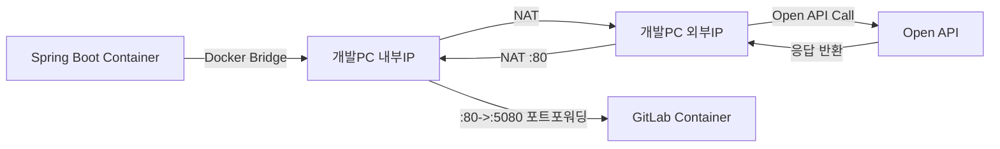

# gitlab-runner-with-docker-troubleshooting

#### 배경

> TO-BE 사내 CRM 프로젝트를 진행하면서 `DevOps 영역`까지 맡게 되었다.
> AS-IS 사내 CRM 레거시 프로젝트는 `SVN` 형상관리와 `Jenkins` 빌드 도구로 배포를 관리하고 있었다. 개발계는 CentOS Linux 환경에서 `수동 배포`가 이루어지고 있었다.</br>
> TO-BE에서는 Ubuntu 운영체제를 시작으로 사내망을 구성하기 위해 `Docker`를 이용하여 `GitLab` 서버를 뛰워 형상관리를 시작하였다.</br>
> 그 후 `GitLab-Runner`와 `SSH`을 이용하여 개발계를 **자동 빌드, 배포화 시키는 CI/CD 환경**을 구축하였다.</br>

#### 목표

> 수동으로 이루어져 매번 빌드 요청을 해야만 했던 프로세스를 이제는 자동화로 이어져 관리자가 편리함을 느끼게 하자. </br>
> SI 회사 이다 보니 CRM DevOps 담당자가 없기 때문에 메뉴얼 가이드를 작성하자.</br>
> 사내 인원들에게 DevOps를 리뷰하여 `배포`를 쉽게 접근 할 수 있도록 해보자.</br>

## 목차

1. [개발계 구성](#-개발계_구성)
2. [배포 전략](#-배포_전략)
3. [TroubleShooting](#-TroubleShooting)

---

## ▶ 개발계 구성

| 항목구분                     | 세부항목         | 설명                                                                                                           |
| ---------------------------- | ---------------- | -------------------------------------------------------------------------------------------------------------- |
| 192.168.0.xxx<br>(GitLab 용) | OS               | Ubuntu 22.04.3 LTS, 계정 , RAM 16g                                                                             |
|                              | SSH Service      | SSH SERVICE 사용, ssh –p 22 root@192.168.0.xxx 접속 가능                                                       |
|                              | Docker Engine    | Docker engine 설치 완료, Docker Bridge 네트워크 활성화 ( 172.17.0.1 )                                          |
|                              | Docker Image     | `gitlab/gitlab-ce` (3.01GB), `gitlab/gitlab-runner` (766MB), node (1.11GB), `gradle` (715MB), `docker` (335MB) |
|                              | Docker Container | `gitlab` (:5080 ), `vue-runner`, `middle-runner`, `sv-runner`                                                  |
|                              | 포트포워딩       | :80 -> :5080 Redirect 설정                                                                                     |

| 항목구분                  | 세부항목         | 설명                                                                            |
| ------------------------- | ---------------- | ------------------------------------------------------------------------------- |
| 192.168.0.xxx<br>(CRM 용) | OS               | Ubuntu 22.04.3 LTS, RAM 16g                                                     |
|                           | SSH Service      | SSH SERVICE 사용, ssh –p 22 root@192.168.0.xxx 접속 가능                        |
|                           | Docker Engine    | Docker engine 설치 완료, Docker Bridge 네트워크 활성화 ( 172.17.0.1 )           |
|                           | Docker Image     | `crmvue` (240MB), `crmmiddleware` (446MB), `crmserver` (452MB), `redis` (117MB) |
|                           | Docker Container | `vue` (:9070 ), `middleware` (:9080 ), `server` (:9000 ), `redis` (:6379 )      |
|                           | 포트포워딩       | 없음                                                                            |

**참고**: 192.168.0.xxx : 5080 포트번호 실행되고 있는 GitLab 서버를 일반 도메인 주소로 접속이 가능하기 위해 포트포워딩 설정
</br>
[GitLab 서버와 개발계 CRM 서버를 분리한 이유](#-TroubleShooting)

## ▶ 배포 전략

1. **CI & Image Push**


    - 1. 개발자가 GitLab 레파지토리에 Commit/Merge 시 exacutor가 Docker인 빌드용 Runner에서 파이프라인을 생성 후, .gitlab-ci.yml 파일의 스크립트에 따라 Build job을 수행한다. 빌드 결과물은 GitLab artifacts에 담는다.
    - 2. Dockerize Job 수행 시 artifacts에 저장 된 빌드 결과물을 DockerFile 스크립트 명령에 따라 Docker Image Build 후 Docker Hub(Registry)에 Push 한다. (단, Image는 private로 저장한다.)

2. **Image Pull & CD**


    - 1. Deploy Job 에서는 exacutor가 Shell인 개발 배포용 Runner가 동작한다.
    - 2. 개발 배포용 Runner는 SSH로 개발 PC에 원격 접속을 한다. .gitlab-ci.yml에 작성된  Docker 명령어를 실행한다.
    - 3. 개발 PC는 Docker Hub에 접속 후, Docker Image를 Pull 후, 설정 된 Port 번호로 Docker Container를 띄운다.

## ▶ TroubleShooting

1. **무수한 이미지 Dangling Image 발생으로 인한 디스크 사용 문제**

개발계 자동화 배포 작업을 끝낸 후, 여러 개발자들이 Commit/Merge 시 개발 PC에 <none> 태그로 된 Image가 쌓인 걸 확인 하였다. </br>

Dangling Image는 이미지 빌드 및 Pull 시 새로운 버전에 이미지가 나왔을 때, 기존의 버전을 가진 이미지는 Dangling Image가 된다. 문제는 이게 쌓이다 보니 디스크 용량을 차지하는게 꽤 비중이 있었다. </br>

그래서 Runner가 빌드 혹은 Docker Image를 Pull 후 작업을 끝내기 전에 Dangling Image가 존재하며 삭제하도록 .gitlab-ci.yml에 파일에 스크립트를 추가 하였다.

```
// dangling_images 존재 확인 후 삭제
    dangling_images=\$(docker images -f 'dangling=true' -q)
&& if [ -n '\$dangling_images' ]; then docker rmi \$dangling_images; fi

```

2. **포트포워딩이 설정 된 서버와 외부 API 연동 이슈**


현재는 개발계를 구축하기 위해 서버실에 PC 2대를 이용하여 `형상관리`와 `개발계 접속용`으로 구축 하였지만, 초기에는 한 PC에 GitLab, Spring, Vue, Redis, Runner가 Container로 띄워져 있었다.

    - **포트포워딩 설정이 필요했던 이유**
        - GitLab에서 Issue와 To-Do List 페이지가 :80 포트로 호출 되는 이슈가 있다. :5080 포트로 띄우게 되면 페이지 진입이 불가하였기에, 차라리 :80 포트를 :5080으로 리다이렉트 시켜 문제를 해결 하였다.

그런데 :80 -> :5080으로 리다이렉트가 문제가 되는 상황이 발생 하였다. **Spring Boot 쪽에서 외부 API를 호출 시 GitLab 초기 페이지로 호출되는 현상이 일어났다.** </br>

원인은 네트워크 흐름에서 찾을 수 있었다.



Nginx 리버스 프록시 설정으로 해결하는 방법도 있지만, **RAM 메모리 부족 현상** 발생한 요인 때문에 개발계 용 PC 하나를 더 추가하여 형상관리와 분리를 시키는 것이였다. Docker Container가 돌아가면 RAM을 사용하게 되는데, **GitLab Container가 약 60% 이상**을 사용하였다. CPU 점유율도 높아지게 되면 Runner 쪽에도 CI/CD 작업이 느려지는 것을 확인 하였다. 그렇게 하여 개발 PC 하나를 더 구축하였고, 외부 API 연동 이슈 해결과 DevOpS 환경을 최적화 할 수 있었다.
